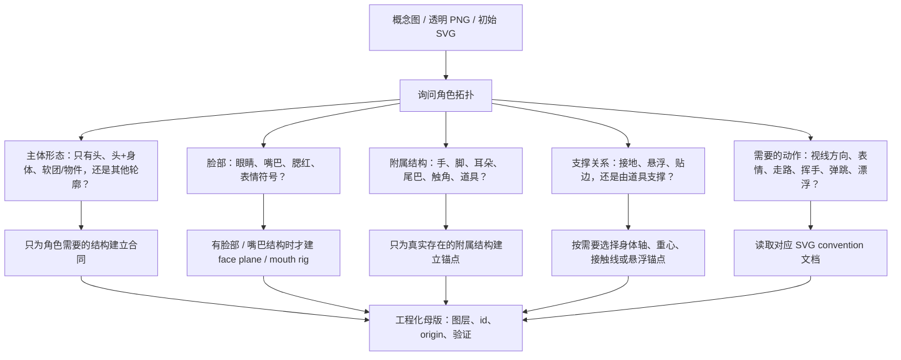
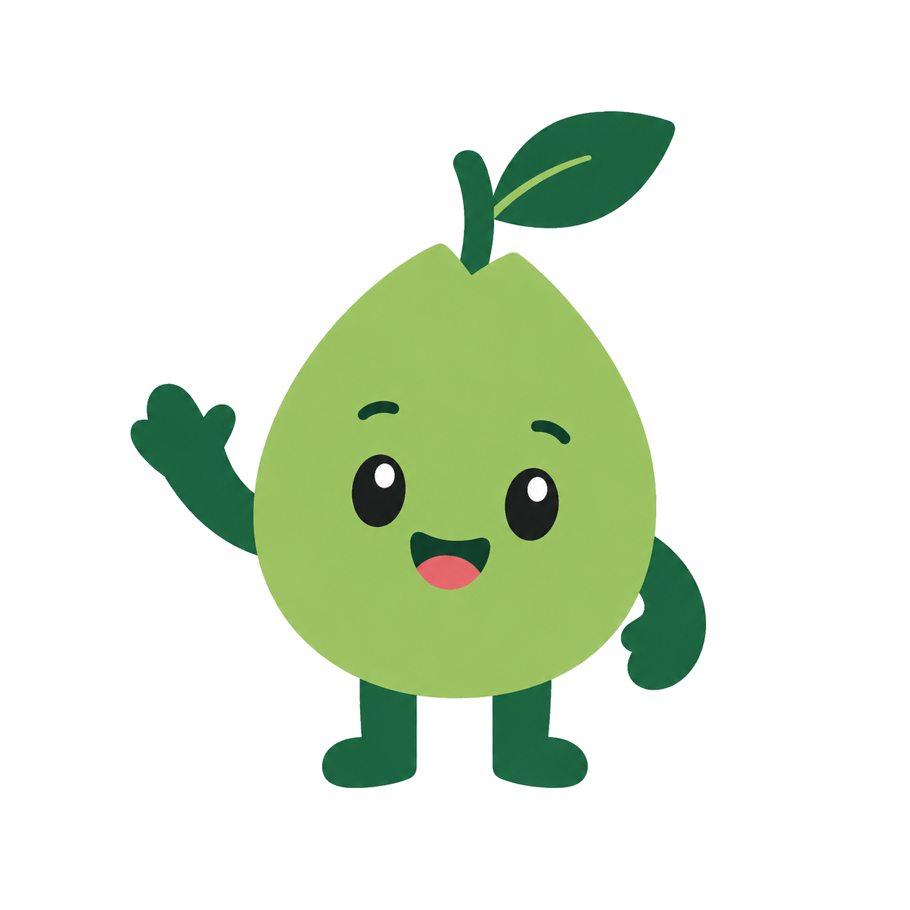
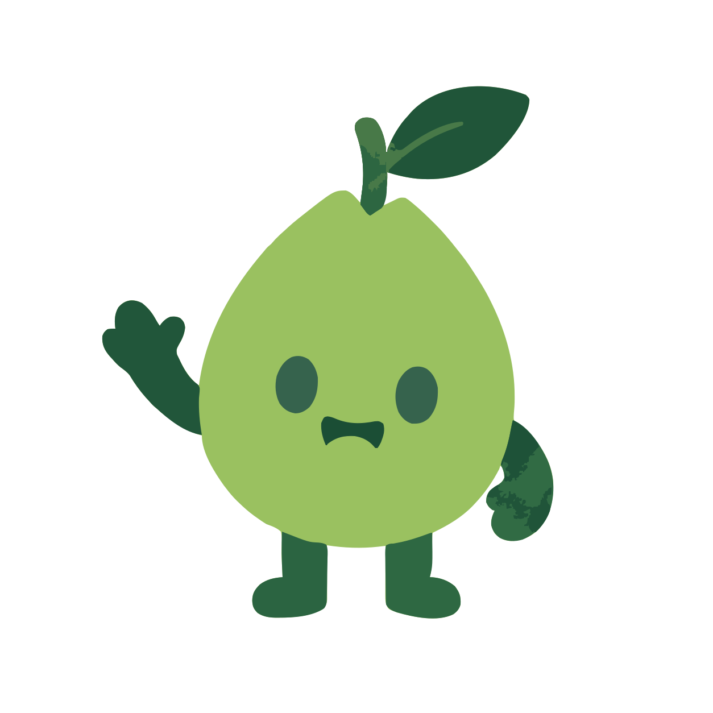

# pet-forge

用于制作自定义 SVG / APNG 桌宠的工具、模板和工作说明。

pet-forge 可以作为独立工具包使用，也可以作为 Codex skill 使用。它不是成品角色包，而是一套可复用的路线指南、prompt 模板、SVG 约定、APNG 后处理脚本、示例和状态映射说明。

## 路线

```
[SVG 路线]                          [APNG 路线]

参考图                               prompt 模板
   -> 去背景                            -> AI 参考图
   -> PNG 转 SVG                        -> 首尾帧锚定的 AI 视频
   -> preset + SVG 模板                 -> 绿幕抠图
   -> 自包含 .svg.html                  -> .apng
```

| 主题 | SVG 路线 | APNG 路线 |
|---|---|---|
| 成本 | 本地环境装好后免费 | 使用免费或付费生成 API |
| 可控性 | 高，每个关键帧都能改 | 较低，重跑很常见 |
| 循环 | 精确 CSS 循环 | 依赖首尾帧锚定 |
| 文件大小 | 通常较小 | 通常数百 KB 或更大 |
| 适合 | 清晰矢量桌宠、小运行时文件 | 丰富视觉风格、快速草稿 |

如果你想要精确循环、小文件和可编辑动画逻辑，选 SVG。

如果你想快速探索丰富视觉风格，并且能接受生成 API 和后处理，选 APNG。

## 作为 Codex Skill 使用

本仓库包含 `SKILL.md`，因此 Codex 可以在规划或制作 SVG / APNG 桌宠资产时把 pet-forge 当作 skill 使用。这个 skill 会把 Codex 引导到仓库里的路线文档、模板、工具、示例和约束，而不是把任务当成从零生成。

当你希望 Codex 帮你选择路线、把透明 PNG 转成 SVG、准备 APNG 生成 prompt、把生成视频后处理成 APNG，或接一个小型可运行 demo 时，可以使用它。

## 先做角色拓扑盘点

在套用头部、附属结构、嘴巴或身体约定之前，先盘点角色真实拥有什么结构。不要默认每个桌宠都有完整的头、身体、手脚和嘴巴。



例如：只有头的角色可能需要 face plane 和表情规则，但不需要脚部 rig；软团角色可能需要轮廓轴、悬浮锚点和 squash 规则，但没有嘴巴；完整吉祥物可能同时需要脸部、身体、附属结构和表情合同。

## 演示：GPT 梨子 SVG 路线

<table>
  <tr>
    <th align="center">1. 源 PNG</th>
    <th align="center">png2svg + vtracer</th>
    <th align="center">2. 生成的 SVG</th>
  </tr>
  <tr>
    <td align="center" width="35%">
      
    </td>
    <td align="center" width="30%">
      <strong>PNG -> SVG</strong><br>
      透明背景<br>
      低色数量化<br>
      位图转矢量追踪<br>
      <code>--preset apple-precise</code>
    </td>
    <td align="center" width="35%">
      
    </td>
  </tr>
  <tr>
    <td align="center">原始位图。背景最好是真 alpha 透明，不要用棋盘格截图。</td>
    <td align="center">工具会清理透明像素、限制颜色数量，再让 vtracer 追踪路径。</td>
    <td align="center">矢量输出：13 条 path，约 21 KB。更容易动画和检查，但小细节会被简化。</td>
  </tr>
</table>

主演示使用 GPT 生成的透明 PNG，经 vtracer 转成 SVG，再包进一个很小的 idle 动画：

- 源 PNG：`examples/svg-gpt-pear/source.png`
- 生成的 SVG：`examples/svg-gpt-pear/pear.svg`
- 可运行 demo：`examples/svg-gpt-pear/idle.svg.html`

复现转换：

```powershell
py -3.13 routes\svg\tools\png2svg\png2svg.py examples\svg-gpt-pear\source.png examples\svg-gpt-pear\pear.svg --preset apple-precise
```

这次运行会生成 13 条 SVG path，文件约 21 KB。关键是源图必须是真透明 PNG；带棋盘格背景的截图会把棋盘格也矢量化，输出会很差。

`examples/svg-soft-orb/` 是一个更小的合成基准 demo，用来对比手工低色数源图和 GPT 生成源图。

## 快速开始

### SVG 路线

```powershell
git clone <pet-forge-repo>
cd pet-forge

# 在浏览器里打开初始 SVG 桌宠：
# routes\svg\templates\hello-idle.svg.html

# 可选：如果 PNG 不是透明背景，先去背景。
py -3.13 -m pip install "rembg[cpu,cli]"
py -3.13 -m rembg i your-character.png your-character-clean.png

py -3.13 -m pip install Pillow numpy scipy vtracer
py -3.13 routes\svg\tools\png2svg\png2svg.py your-character-clean.png character.svg --preset apple-precise
```

然后把生成的 SVG path 复制进 `routes/svg/templates/hello-idle.svg.html`，再调 CSS 变量和 preset。

PNG 转 SVG 这一步使用 vtracer 作为矢量化引擎。它最适合简单、低色数、边界干净的图形；复杂照片、渐变、毛发、纹理和噪点边缘可能生成巨大或很差的 SVG。源图复杂时，优先走 APNG 路线，或手工重画关键 SVG 结构。

### APNG 路线

```powershell
git clone <pet-forge-repo>
cd pet-forge\routes\apng\tools

npm install
py -3 -m pip install Pillow numpy

copy .env.example .env
# 在 .env 里填写你的 API key。

node test-api.js
node gen-images.js --prompt "A cute chibi ..." --output reference/main-ref.png --api doubao
node gen-video.js idle-dozing --image reference/main-ref.png --last-frame reference/main-ref.png --api doubao
```

如果需要手动重跑绿幕抠图：

```powershell
py chroma_key.py output/idle-dozing/doubao-video.mp4 output/idle-dozing/result.apng --plays 0
```

## 仓库结构

```
pet-forge/
├── README.md
├── SKILL.md
├── CLAUDE.md
├── routes/
│   ├── svg/
│   │   ├── presets/
│   │   ├── templates/
│   │   ├── conventions/
│   │   ├── lessons/
│   │   └── tools/png2svg/
│   └── apng/
│       ├── prompts/
│       ├── conventions/
│       ├── lessons/
│       └── tools/
├── shared/
└── examples/
```

## 本仓库不做什么

- 不包含成品角色资产。
- 不附带私有源项目文件。
- 不提供 API key，也不替你支付生成服务费用。
- 不替你决定最终审美。
- 不承诺一键生成完整多状态桌宠。

## 许可

本仓库的文档、模板和原创包装代码使用 MIT 许可。见 [LICENSE](LICENSE)。

部分脚本改编自早期内部原型；公开发布时应在适用位置保留来源和署名说明。角色设计、生成图和产品资产与本工具包分离，不包含在仓库内。
